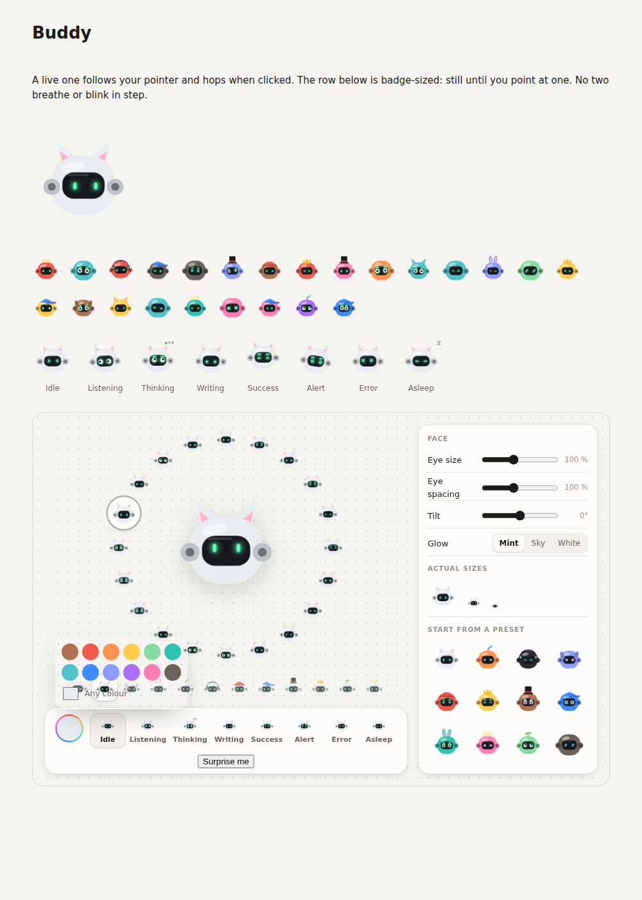

# @anarchy/buddy

Anarchy's sidekick as a module of its own: a little robot with a visor, glowing
eyes, twenty faces, eight moods and eleven kinds of headwear, drawn in plain SVG
and moved with CSS. No dependencies, no framework, no build step.

Use it the way OpenAI's dots or Grok's companions are used: as the face of an
agent, anywhere a name or an avatar goes.



```html
<link rel="stylesheet" href="buddy.css">
<script src="buddy.js"></script>
<script>
  // Alive: idle motion, eyes that follow the pointer, a hop when clicked.
  document.body.append(Buddy.live("s2.bot.bean.e9edf2.100.100.0.a.cat"));
</script>
```

With a bundler: `const Buddy = require("@anarchy/buddy")` and import `buddy.css`.

## A look is one string

```
s2.<shape>.<face>.<rrggbb>.<eye size %>.<eye spacing %>.<tilt °>.<glow a|b|w>[.<headwear>]
s2.bot.bean.e9edf2.100.100.0.a.cat
```

Short enough to keep beside a user's name and send to other people's apps.
`Buddy.parse` reads one (anything unknown falls back), `Buddy.format` writes one.

## API

| Call | Gives |
|---|---|
| `Buddy.live(look, state?, { track, react, seed })` | An `<svg>` that's alive |
| `Buddy.svg(look, state?, { seed, hover })` | A still one, for badges: it comes alive while the pointer is on it |
| `Buddy.patch(svg, look, state?)` | Changes one in place: colours fade, eyes glide, a new face arrives behind a blink |
| `Buddy.kick(svg, "sk-jump")` | A one-shot: `sk-pop`, `sk-squish`, `sk-jump`, `sk-spin` |
| `Buddy.maker(el, get, set)` | The designer: faces, headwear, colour, glow, sliders, presets |
| `Buddy.random()` | A random look |
| `Buddy.seeds(string)` | The idle timings a seed gives |

States: `idle`, `listening`, `thinking`, `writing`, `success`, `alert`, `error`, `asleep`.

## Motion

The idle motion follows [blobatar](https://github.com/Alain00/blobatar) (MIT):

- **Three loops that never line up.** A breathe (a 2% squash, 2.8 s), a bob (3.4 s) and glances. The periods aren't multiples of each other, so they drift in and out of phase instead of beating as one pulse.
- **Glances jump and hold**, like eyes do, rather than sliding about.
- **Seeded.** Blink and glance periods, where each loop starts, and which way a Buddy likes to look all come from a hash of its look (or any seed you pass). The same Buddy always moves the same way; a row of different ones never moves in step.
- **An amplitude, not a switch.** `--bd-amp` is a registered custom property: 1 on a live Buddy, 0 on a badge until it's pointed at, where it eases up. A grid of badges sits still, and the loops are paused while they do.
- `prefers-reduced-motion` stops all of it. On touch screens only live Buddies move.

## Open the demo

`demo.html` works straight from disk.

## In Anarchy

The desktop app ships a copy in `apps/desktop/ui/buddy/`. `node build.mjs` refreshes it, and CI fails if the copy and this folder differ.
